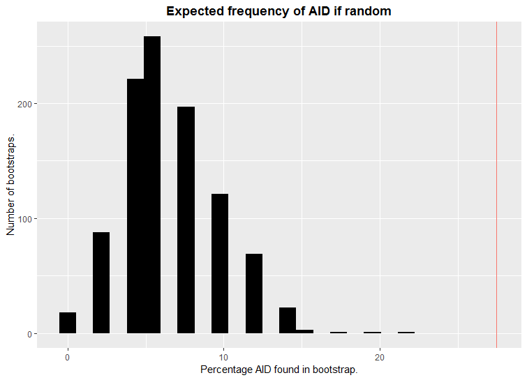
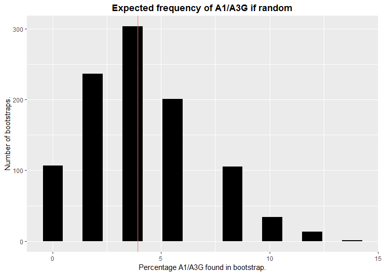

```{r setup, include = FALSE}
knitr::opts_chunk$set(
  collapse = TRUE,
  comment = "#>"
)
library(cMut)
```
<html>
<head>

<style type="text/css">
abbr {    
    border-bottom: 1px dotted #000;
    text-decoration: none;
}
</style>
</head>

</html>

The cMut (clustered mutation) package provide functions to find and annotate clustered mutations.
In the following examples, the functions will be explained and used.

# Contents {#Context}
* [What can the cMut package do?](#What)
* [Simulate Random Mutations](#Simulate)
* [Default Mutation Patterns](#Default)
* [Link Mutations to Mutation Patterns](#Link)
* [Identify and Annotate Clusters](#Identify)
* [Group Clusters and Find Cluster Patterns](#Group)
* [Summarize the Found Patterns](#Summarize)
* [Determine the Enrichment of a Mutation Pattern](#Determine)
* [Ways to adapt cMut for your analysis](#Ways)

\pagebreak

# What can the cMut package do? {#What}  
A subset of the mutations that happen in the human genome occur very close to each other. Such local enrichment of mutations are often called mutation clusters. It has been hypothesized that clustered mutations occur by mechanisms that are different from the mechanisms of non-clustered mutations, making this group particularly interesting to study.
There are mutational influences that tend to cause mutations of very specific types. One example is the human protein APOBEC3A, which causes C > T mutations at nucleotide positions that are preceded by CT or TT nucleotides and followed by an A nucleotide at high specificity. APOBEC3A is suspected to cause a subset of clustered mutations.
The cMut package analyses clustered SNV mutations for the presence of custom mutation patterns and can calculate whether these patterns are enriched.  
  
~[Back to Context](#Context)~  

\pagebreak

# Simulate Mutations at Random Positions {#Simulate}
The `createRandomMutation()` function simulates single nucleotide variant (SNV) mutations at random positions of the human reference genome GRCh37/hg19 (or GRch38/hg38 if `refGenomeHg19 = FALSE`) and store them in a tibble (data.frame like object from the tidyverse package).
```{r echo = TRUE, results = 'hide'}
randomData <- createRandomMutations(nMut = 10)
randomData
```
```{r echo=FALSE}
knitr::kable(randomData,align = 'c')
```
  
For more information about the table, use:
```{r include = TRUE}
cat(comment(randomData))
```
  
~[Back to Context](#Context)~  
  
\pagebreak

# Default Mutation Patterns {#Default}
The following functions below use a search table to see if it is possible to match the mutation with certain mutation patterns. If no custom mutational patterns are supplied, cMut uses a standard search table of mutation patterns called `mutationPatterns`.

In this table, there are two kinds of patterns:  
  
### Mutation Patterns
```{r echo = FALSE}
knitr::kable(mutationPatterns[1:9,], algin = 'c')
```  
  
Patterns with 1 reference, 1 alternative, with surrounding nucleotides and a maximum distance with a number or NA. These are used in the [identifyClusters()](#Identify) and [linkPatterns()](#Match) functions. These patterns will be called 'mutation patterns' in the documentation of this package.

### Cluster Patterns
```{r echo = FALSE}
knitr::kable(getSearchPatterns(F,F,F)[10:15,], algin = 'c')
``` 
  
Patterns with more than 1 or no reference, more than 1 alternative, no surrounding nucleotides and always a maximum distance (in this case: `PolZeta` and `PolZeta.endOnly`). These are used in the [groupClusters()](#Group) function. These are separately evaluated from the mutation patterns because these patterns depend on the order and distance of the mutations within a cluster. These patterns will be called 'cluster patterns' in the documentation of this package.  
  
## Nucleotide symbols
As seen in the table there are nucleotides that do not match with the well known A,G,C,T nucleotides. That is because these are not nucleotides but symbols that represent the nucleotides as shown in the `dnaAlphabet` table:
```{r echo = TRUE, results='hide'}
dnaAlphabet
```
```{r echo=FALSE}
knitr::kable(dnaAlphabet,align = 'c')
```
  
For more information, see the [NC-IUB, 1984](<https://www.ncbi.nlm.nih.gov/pmc/articles/PMC322779/>) article for more information.  
  
~[Back to Context](#Context)~  
  
\pagebreak

# Link Mutations to Mutation Patterns {#Link}
The `linkPatterns()` function will check if the provided mutation can be matched with the mutation patterns from the search pattern table and returns the ID's of the match.
The default search table is used if no search pattern table is sent with the `searchPattern` argument.  
See [Default mutation patterns](#Default) paragraph above for more information.  
  
A proper way of using this function with the default search table:
```{r include = TRUE}
linkPatterns(ref     = "C",
             alt     = "G",
             context = "CT.AT")
```
  
If distance is important for the mutation pattern, use the `distance` argument to tell the distance to the nearest mutation within a cluster. Make sure that the search pattern table has a column with the maximum distance for the specific pattern.
```{r include = T}
linkPatterns(ref = "A", alt = "G", context = "TA.TA", distance = 550)
linkPatterns(ref = "A", alt = "G", context = "TA.TA", distance = 50)
```

As seen in the [Default mutation patterns](#Default) paragraph, it is possible to use alternative nucleotide symbols. However it is not possible to use these symbols in the look up mutation (So the one provided in the `ref`, `alt` and `context` arguments):
```{r include = TRUE, error = TRUE}
linkPatterns(ref = "C", alt = "D", context = "A.A")
```

By default the `linkPatterns()` function will also look at the <abbr title = "The sequence on the opposing strand in reverse so DNA is mostly written down as something like 5'AGCGT3' so the complement would be 3'TCGCA5' and then the reverse is 5'ACGCT3'. The reverse complement is good to know because most mutators are not strand specific and also checking the reverse complement you will look at both strands.">reverse complement</abbr> of each pattern in the sent search table:
```{r include = TRUE}
linkPatterns(ref     = "C",
             alt     = "G",
             context = "CT.AT")

linkPatterns(ref     = "G",
             alt     = "C",
             context = "AT.AG")
```
There are a few arguments that involves in searching for the reverse complement:

First, the `searchReverseComplement` argument tells if the search pattern table as needs to be used in the reverse complement version 
```{r include = TRUE}
# Example search pattern table
exampleSearch <- data.frame(stringsAsFactors = FALSE,
                            process          = c("id1", "id2"),
                            ref              = c("A","T"),
                            alt              = c("S","S"),
                            surrounding      = c("T.T","A."))
exampleSearch

linkPatterns(ref                     = "A",
             alt                     = "G",
             context                 = "GT.TC",
             searchPatterns          = exampleSearch,
             searchReverseComplement = TRUE)

linkPatterns(ref                     = "A",
             alt                     = "G",
             context                 = "GT.TC",
             searchPatterns          = exampleSearch,
             searchReverseComplement = FALSE)
```
  
Second, the `reverseComplement` argument tells if the sent mutation (in this case A>G; GT.TC) needs to be converted to the reverse complement version of itself. Make sure that searchReverseComplement is FALSE otherwise it shall give the same results as above.
```{r include = TRUE}
linkPatterns(ref                     = "A",
             alt                     = "G",
             context                 = "GT.TC",
             searchPatterns          = exampleSearch,
             searchReverseComplement = FALSE,
             reverseComplement       = TRUE)

linkPatterns(ref                     = "A",
             alt                     = "G",
             context                 = "GT.TC",
             searchPatterns          = exampleSearch,
             searchReverseComplement = FALSE,
             reverseComplement       = FALSE)
```

Finally, the last argument is `renameReverse`. This arguments tells if the IDs of the reverse complement version of search pattern table needs to be called differently: \*ID\* [Rev.Com.]. This is nice if you want to know if the match came from the reverse complement or not.
```{r include = TRUE}
linkPatterns(ref                     = "A",
             alt                     = "G",
             context                 = "GT.TC",
             searchPatterns          = exampleSearch,
             searchReverseComplement = TRUE,
             renameReverse           = TRUE)

linkPatterns(ref                     = "A",
             alt                     = "G",
             context                 = "GT.TC",
             searchPatterns          = exampleSearch,
             searchReverseComplement = TRUE,
             renameReverse           = FALSE)
```
Apart from  the arguments `ref`, `alt` and `context`, all arguments for `linkPatterns()` function are also available in the [identifyClusters()](#Identify) and [groupClusters()](#Group) functions.  
  
~[Back to Context](#Context)~  
  
\pagebreak

# Identify and Annotate Clusters {#Identify}
To start the analysis directly from a list of mutations, use the function `identifyClusters()`. It looks for clusters by scanning per sample per chromosome if the mutations are closer to each other than the maximum distance. It also applies [linkPatterns()](#Match) to every clustered mutation row of the supplied table. Beside those functions, it will also add the distance towards the nearest mutations and columns with <abbr title = "Datatype that is either TRUE or FALSE">Booleans</abbr>. These columns tells whether or not the function were able to put to mutation in a cluster (the `is.clustered` column) and if this mutation could be linked to a mutation pattern (the `is.linked` column`).  
```{r echo = TRUE, results = 'hide'}
results <- identifyClusters(dataTable   = testDataSet, 
                            maxDistance = 20000,
                            asTibble    = FALSE)
head(results[results$is.linked, ])
```
```{r echo=FALSE}
knitr::kable(head(results[results$is.linked, ]), align = 'c')
```
  
Please make sure that the <abbr title = 'The values that are already filled in for the function's arguments. See the usage section at the function's help page to see these values.'>default arguments</abbr> for column names (`chromHeader`, `sampleIdHeader`, `positionHeader`, `refHeader`, `altHeader` and `contextHeader`) correspond with the column headers of the supplied table or change it if needed. The presence of other columns should not be a problem but make sure that there are no column names duplicating the ones in  the arguments.  
For an example of the input for the `dataTable` argument see the `testDataSet` table or use the [createRandomMutations()](#Create) function.   
  
When using your own search pattern table with column names or others arguments that do not match with the default, please make sure to change the corresponding `search*` arguments.
```{r echo = TRUE, results = "hide"}
# Example of using you own search pattern table:

# Build an example table
testPatterns <- data.frame(id          = c("testPat1", "testPat2"),
                           reference   = c("A", "G"),
                           alternative = c("T", "C"), 
                           dist        = c(NA, NA),
                           sur         = c("-", "DB-Y"))
testPatterns
```
```{r echo = FALSE}
knitr::kable(testPatterns, align = 'c')
```
```{r echo = TRUE, results = "hide"}
# Using the table on the function:
results2 <- identifyClusters(dataTable               = testDataSet, 
                             maxDistance             = 20000,
                             asTibble                = FALSE,
                             linkPatterns            = TRUE,
                             searchPatterns          = testPatterns,
                             searchIdHeader          = "id",
                             searchRefHeader         = "reference",
                             searchAltHeader         = "alternative",
                             searchDistanceHeader    = "dist",
                             searchContextHeader     = "sur",
                             searchMutationSymbol    = "-",
                             searchReverseComplement = FALSE)
tail(results2[results2$is.linked,])
```
```{r echo = FALSE}
knitr::kable(tail(results2[results2$is.linked,]), align = 'c')
```
  
For more information about the added columns, use:
```{r include = TRUE}
cat(comment(results))
```
  
~[Back to Context](#Context)~  

\pagebreak

# Group Clusters and Find Cluster Patterns {#Group}
To group and summarize the data by mutation clusters, there is a function `groupClusters()`. It also adds a column with the intersection (overlap) of the patterns per cluster and found cluster patterns (See the [Default mutation patterns](#Default) chapter above for more information about cluster patterns). The input for the `groupClusters()` function is the result of the [identifyClusters()](#Identify) function  
```{r echo = TRUE, results = 'hide'}
results <- identifyClusters(dataTable    = testDataSet, 
                            maxDistance  = 20000)

groups <- groupClusters(dataTable = results)

head(groups[groups$has.clusterPatterns | 
              groups$has.intersect, -which(names(groups) == "cMuts")])
```
```{r echo=FALSE}
knitr::kable(groups[groups$has.clusterPatterns | groups$has.intersect, -which(names(groups) == "cMuts")], align =  'c')
```
  
The handling of mutation patterns' reverse compliments can be adapted using the arguments lined out in the [linkPatterns()](#Match) paragraph. This allows for fine-graded control of the patterns to be adapted. To give an example, if the goal of the analysis is to identify mutation patterns that lie on the same strand, regardless of this is the plus-strand or the minus-strand, use the `renameReverse = TRUE` argument. This spares out the detection of patterns that are on different strands.
```{r include = TRUE}
results2 <- identifyClusters(dataTable    = testDataSet, 
                             maxDistance   = 20000,
                             renameReverse = TRUE)

groups2 <- groupClusters(dataTable     = results,
                         renameReverse = TRUE)

groups2[groups2$has.clusterPatterns | groups2$has.intersect,"foundPatterns"][[1]]
```
  
For more information about the columns of the results, use:
```{r include = TRUE}
cat(comment(groups))
```
  
~[Back to Context](#Context)~  
  
\pagebreak

# Summarize the Found Patterns {#Summarize}
To summarize the clusters that are given out by [groupClusters()](#Group), the function getSummaryPatterns() gives the number of clustered mutations affected by each mutation pattern. The `unidentified` row contains the information about the clusters that didn't have a linked pattern.
```{r echo = TRUE, results='hide'}
results <- identifyClusters(dataTable   = testDataSet, 
                            maxDistance = 20000)

groups <- groupClusters(dataTable = results)

getSummaryPatterns(groupedClusters = groups) 
```
```{r echo = FALSE}
knitr::kable(getSummaryPatterns(groups), align = 'c')
```
  
Make sure to use the same `searchPatterns` table that you used in previous functions. Otherwise if the `groupedClusters` table contains patterns that are not present in the current `searchPatterns` table, then it will be marked as unidentified together with clusters without patterns.
```{r echo = TRUE, results = 'hide'}
example <- getSearchPatterns()[1, ] # Default search table with only the first row
example
```
```{r echo = FALSE}
knitr::kable(example, align = 'c')
```
```{r echo = TRUE, results = 'hide'}
getSummaryPatterns(groupedClusters = groups,
                   searchPatterns  = example)
```
```{r echo = FALSE}
knitr::kable(getSummaryPatterns(groups, searchPatterns = example), align = 'c')
```
  
Please note that if you used `renameReverse = TRUE` in [identifyClusters()](#Identify) and/or [groupClusters()](#Group) functions then also use it in the `getSummaryPatterns()` function. Otherwise the reverse complement patterns will end up in the "Unidentified" row.
```{r echo = TRUE, results='hide'}
getSummaryPatterns(groupedClusters = groups2,
                   renameReverse   = TRUE)
```
```{r echo = FALSE}
knitr::kable(getSummaryPatterns(groups2,
                   renameReverse  = TRUE), align = 'c')
```
```{r echo = TRUE, results = 'hide'}
getSummaryPatterns(groupedClusters = groups2)
```
```{r echo = FALSE}
knitr::kable(getSummaryPatterns(groups2), align = 'c')
```
  
~[Back to Context](#Context)~  
  
\pagebreak

# Determine the Enrichment of a Mutation Pattern {#Determine}
Clusters might be affected by mutation patterns either because they were caused by mutator that causes the pattern, or alternatively, they might because of chance. In the scenario that these mutation clusters are caused by chance, we would expect only a limited number of affected clusters, while if the mutator is active, there should be an over enrichment of the mutation pattern in the data. In order to distinguish these two possibilities, cMut can estimate whether there is an over enrichment.

For this, the function `shuffleMutations()` shuffles the reference, alternative and surrounding nucleotides of the observed clustered mutations and analyzes the shuffled data sets. For each reshuffling, the number of simulated mutations within the clusters affected by the mutation patterns are recorded. By comparing the number of mutations within the clusters affected in the resampled data sets to the original, observed data, we get an estimate of the over enrichment. To save time, you can use the `no.cores` argument to enable parallelization. It takes the number of cores that are used for the computations. The default is the maximum number of cores available to your system.
```{r echo = TRUE, results = 'hide', message=FALSE}
clusteredMut <- results[results$is.clustered == TRUE,]
shuffle <- shuffleMutations(dataTable  = clusteredMut,
                            nBootstrap = 5,
                            no.cores   = 1)
# 1 core is used because of the limitation of CRAN check system
shuffle
```
```{r echo = FALSE}
# The hidden while loops are to make sure that a good example is shown
while(shuffle[8,"percentage"][[1]] == 100){
  invisible(capture.output(shuffle <- shuffleMutations(dataTable  = clusteredMut,
                                                       nBootstrap = 5,
                                                       no.cores   = 1)))  
}
knitr::kable(shuffle)
```
  
For more information about the results:  
```{r include = TRUE}
cat(comment(shuffle))
```
  
If wanted it is also possible to get the results per bootstrap:  
```{r echo = TRUE, results='hide', message=FALSE}
clusteredMut <- results[results$is.clustered == TRUE, ]
shuffle <- shuffleMutations(dataTable             = clusteredMut,
                            nBootstrap            = 2,
                            no.cores              = 1,
                            returnEachBootstrap   = TRUE)
shuffle
```
```{r echo = FALSE}
knitr::kable(shuffle)
```
The row with "total" as ID, represent the number of mutation rows that were clustered. Can be used to calculate the percentages as shown in the result table when `returnEachBootstrap = FALSE`.  
  
## Interpretation of Results
The following code will show an example of how to use all the main functions properly and how to compare it with the `shuffleMutations()` functions' results.
```{R eval=FALSE}
# Example data to work with:
data <- testDataSet

# Identify and Annotate clusters:
resultsPerMutation <- identifyClusters(dataTable   = data,
                                       maxDistance = 20000)
# Group the clusters
resultsPerCluster <- groupClusters(dataTable = resultsPerMutation)

# Summarize the pattern results
summary <- getSummaryPatterns(groupedClusters = resultsPerCluster)

# Estimate the enrichment:

# Best to only sent clustered mutations to the shuffle function
shuffleData <- resultsPerMutation[resultsPerMutation$is.clustered, ]
# Use the shuffle function.
# We used the returnEachBootstrap argument so we'll be able to draw a graph from the results
shuffleResults <- shuffleMutations(dataTable           = shuffleData, 
                                   maxDistance         = 20000,
                                   nBootstrap          = 1000,
                                   returnEachBootstrap = TRUE)
```
After using these functions we can build a plot with the shuffle results and compare it with the found results from the testDataSet.
```{r eval = FALSE}
# The first 2 out of the 1000 bootstrap results:
shuffleResults[1:2]
```
```{r include=TRUE}
knitr::kable(readRDS("firstTwoShuffleResults.rds"))

```
Building a plot with these results can be done with your favorite method.
  
In the following plots, the black bars represent the distribution of the percentage of clusters with a mutation pattern. The red vertical line represent the percentage that we observed in the testDataset.  
In the following image you can see an example when a pattern is enriched:
  

As you can see, the red line is far outside the distribution of reshuffled events and therefore indicate that the pattern is enriched.  
  
And in the following plot you see an example when it's not enriched:
  
  
In the plot you can see that the red line is within the distribution of reshuffled events an is therefore not enriched.
  
You can also determine the P-value to have a more statistical clue. You could use the following formula: `1 - (below / nBootstrap)`. In this formula the `below` part represent the number of bootstraps that found the pattern less than the observed value and the `nBootstrap` part represent the total number of bootstraps.  
So in the plot examples above the AID pattern has 0.00 and the A1/A3G pattern 0.66 as P value.
Don't forget to correct for the multiple testing problem as well.  
  
	
# Ways to adapt cMut for your analysis {#Ways}
The mutation patterns are completely customizable and can be adapted by the user. The definition of mutation clusters depends on a threshold for a maximum distance between the mutations, this threshold can also be adapted. For each mutation pattern to investigate, an additional maximal distance can also be set.
  
### Bugs, questions, suggestions?
Feel free to the contact the creator! (^__^)  
alex.janse.nl@hotmail.com
